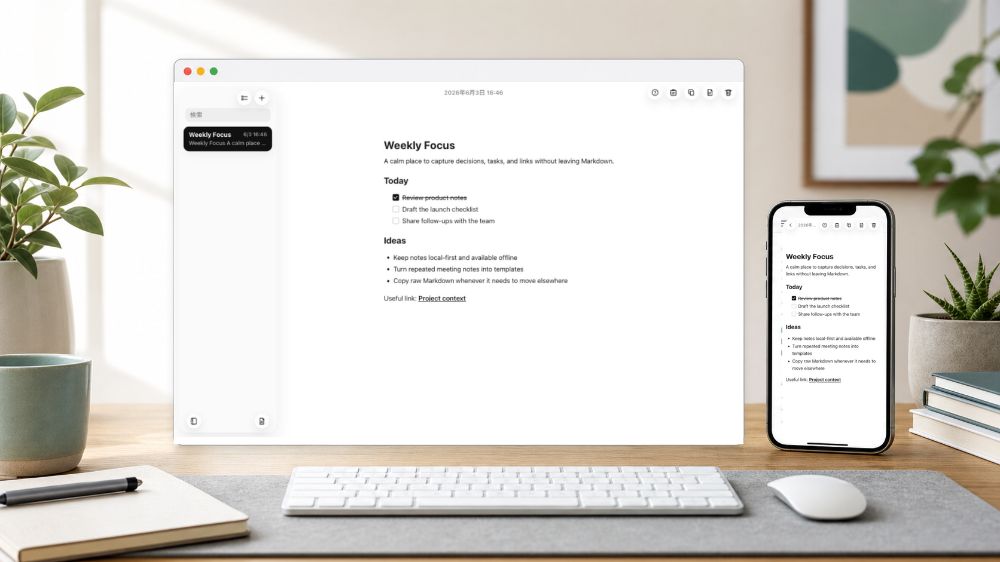

# Jot Down



Jot Down is a local-first Markdown note PWA for capturing lightweight notes, tasks,
links, and reusable writing patterns without leaving the editor.

It keeps Markdown as the source of truth and stores notes in the browser's local
note store. There is no account system, server-side app state, or cloud sync.

## Features

- Markdown live editing: write Markdown while headings, lists, links, and tasks stay structured in the same surface.
- Local-first and offline-first: create, edit, search, delete, and apply templates without a network connection.
- Autosave: note and template changes are saved without a user-facing save button.
- Note search: find notes with case-insensitive partial matching against Markdown content.
- Checkable tasks: toggle `- [ ]` and `- [x]` tasks while preserving them as Markdown text.
- Note templates: manage reusable Markdown patterns and apply them to new or existing notes.
- Keyboard editing: toggle task state and move note lines from the keyboard.
- PWA update flow: installed PWAs detect new versions and wait for the user before reloading.

## Supported Markdown

Jot Down treats these Markdown shapes as first-class:

- Headings
- Paragraphs
- `-` bullet lists
- `- [ ]` and `- [x]` tasks
- Links
- Strong emphasis

Other Markdown-like text is kept as note text, but the initial version does not
treat it as a dedicated structure.

## Product Principles

- Markdown text is the source of truth.
- A note title is derived from the first heading, or from the first non-empty line when there is no heading.
- A task is a note line, not a standalone todo object.
- Notes are ordered by most recent Markdown edit time.
- Deletion is confirmed and does not create a trash or archive area.
- List navigation is display state; it does not change note content, note search, or note order.

## Tech Stack

- React 19
- TypeScript
- Vite
- MDXEditor
- Dexie / IndexedDB
- Vite PWA
- Biome
- ESLint
- Vitest
- Cloudflare Workers Static Assets

## Development

Install dependencies. The `prepare` script also registers the repository Git hooks.

```bash
npm install
```

Start the local development server.

```bash
npm run dev
```

Run checks.

```bash
npm run format
npm run lint
npm run typecheck
npm run test
npm run check
```

`npm run check` runs format verification, lint, type checking, and coverage-backed
tests. The same check runs from the pre-push hook.

## Deployment

Jot Down is designed to deploy as a Cloudflare Workers Static Assets app.

```bash
npm run build
npm run deploy
```

When changes reach `main`, GitHub Actions is expected to run the same project
checks before deploying with `wrangler deploy`.

## Out Of Scope

- User accounts
- Cloud sync
- Import / export
- Tags and pinned notes
- Due dates, reminders, and notifications
- Separate preview mode
- App-specific settings screen
